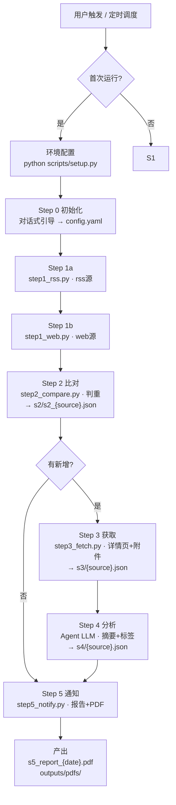

# GxpCode-制药法规跟踪

自动扫描法规源，发现新发布/修订/废止的法规&指南，分析摘要打标签并判断与企业产品的关联程度，生成 PDF 跟踪报告。

## 环境配置

> ⚠️ **首次安装本 skill 时必须运行**（仅需一次，后续直接使用）：

```bash
python scripts/setup.py
```

环境就绪后跳过此步骤，直接进入工作流。

## 工作流概览



---

## 步骤索引

| Step | 说明 | 输入 ← 输出 | 详情 |
|------|------|------|------|
| 0 | 初始化 | 对话式引导 → config.yaml | 本文件 |
| 1 | 检测 | rss 源 → step1_rss.py / web 源 → step1_web.py → s1/s1_{源名}.json | `resources/s1_rss_prompt.md` `resources/s1_web_prompt.md` |
| 2 | 比对 | s1/ + history.json → s2/s2_{源名}.json + s2/.done | `resources/steps/step_2.md` |
| 3 | 获取 | s2/ → 详情页文本+附件 → s3/s3_{源名}.json + s3/.done + outputs/pdfs/ | `resources/steps/step_3.md` |
| 4 | 分析 | s3/ + config.yaml → s4/s4_{源名}.json + s4/.done | `resources/steps/step_4.md` |
| 5 | 通知 | s4/ → s5_report_{date}.md + s5_report_{date}.pdf + history.json 更新 | `resources/steps/step_5.md` |
| A | 新源分析 | URL → extract 配置 → sources.yaml（按需触发） | `resources/source_analysis_prompt.md` |

---

## Step 0 — 启动检查

> 前置条件：首次使用前需运行 `python scripts/setup.py` 完成环境配置。

检查 `resources/config.yaml` 是否存在。存在则跳过初始化，直接进入 Step 1。不存在则执行对话式引导。

依次询问：

> 请选择您的企业类型（可多选）：A. 化药  B. 中药  C. 生物制品  D. 原料药  E. 辅料包材

> 请选择重点关注领域（可多选，或输入"全部"）：GMP / 注册 / 变更 / 稳定性 / 工艺验证 / 分析方法 / 杂质 / 临床试验 / 药物警戒

确认后写入 `resources/config.yaml`，完成后进入 Step 1。

---

## Step A — 新源分析（分支步骤）

触发条件：用户提供新的法规源 URL。

详情见 `resources/source_analysis_prompt.md`。

---

## 数据目录结构

```
{workspace}/gxpcode_data/
  s1/s1_{源名}.json          # S1 各源条目
  s2/s2_{源名}.json          # S2 新增条目
  s2/.done
  s3/s3_{源名}.json          # S3 正文+附件路径
  s3/.done
  s4/s4_{源名}.json          # S4 分析结果
  s4/.done
  s5_report_{date}.md        # S5 报告
  s5_report_{date}.pdf       # S5 报告 PDF
  outputs/pdfs/              # 附件 PDF

{SKILL_DIR}/gxpcode_data/
  history.json               # 历史记录（跨 workspace 持久）
```

---

## 强制约束

1. 所有脚本通过 Python 执行：`python "${SKILL_DIR}/scripts/stepN_xxx.py" gxpcode_data`
2. S4 为 Agent LLM 分析，分段执行（每批 ≤5 条）
3. 容错原则：SOURCE_SKIP 跳过单个源，ITEM_SKIP 跳过单条，仅 FATAL 停止全流水线
4. 敏感信息使用环境变量占位符 `${VAR_NAME}`
5. 每步完成后落地 `.done` 标记文件
